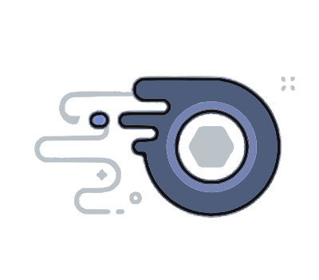

<!-- Improved compatibility of back to top link: See: https://github.com/Buttermiilk/nitro-code-generator/pull/73 -->
<a name="readme-top"></a>

[![Contributors][contributors-shield]][contributors-url]
[![Forks][forks-shield]][forks-url]
[![Stargazers][stars-shield]][stars-url]
[![Issues][issues-shield]][issues-url]
[![MIT License][license-shield]][license-url]
[![Python][python-shield]][python-url]

<!-- PROJECT LOGO -->
<br />
<div align="center">
  <a href="https://github.com/Buttermiilk/nitro-code-generator">
    
  </a>

  <h3 align="center">Discord Nitro Generator</h3>

  <p align="center">
    A roughly $3.12 \times 10^{-30}$ chance of a valid Nitro key generator (with ratelimit check included), test your luck!
    <br />
    <a href="https://github.com/Buttermiilk/nitro-code-generator/issues">Report Bug</a>
    ·
    <a href="https://github.com/Buttermiilk/nitro-code-generator/issues">Request Feature</a>
  </p>
</div>


<!-- TABLE OF CONTENTS -->
<details>
  <summary>Table of Contents</summary>
  <ol>
    <li>
      <a href="#about-the-project">About The Project</a>
    </li>
    <li>
      <a href="#getting-started">Getting Started</a>
      <ul>
        <li><a href="#prerequisites">Prerequisites</a></li>
        <li><a href="#installation">Installation</a></li>
      </ul>
    </li>
    <li><a href="#usage">Usage</a></li>
    <li><a href="#contributing">Contributing</a></li>
    <li><a href="#license">License</a></li>
  </ol>
</details>


<!-- ABOUT THE PROJECT -->
## About The Project

Actually uh this is a learning project, you shouldn't attempt to try this if you don't have the patience. As mentioned above the chances for getting a key is extremely low, you probably would mark this as not working.

But if you have the passion to actually choose me and try this:
* A lot of the repos out there do this the incorrect way (either to spam the API to get a 17-hour ratelimit like me or to misunderstand things). The point of this repo is to fix that.
* If you try this, be sure to spend ~~some time~~ a few weeks looking at it because of that super small chance I mentioned. Well, that's what you get for brute-forcing.
* Code's fairly simple. Like, look, there are only 2 files that you need to care about.

I'll make sure to ruin your entire day with this, heheh.

Scroll down to get started.

<p align="right"><a href="#readme-top">back to top</a></p>

<!-- GETTING STARTED -->
## Getting Started

It's... believe me, very simple. You can just get rolling by a few steps.

### Prerequisites

Get [Python](https://python.org) and [git Command Line Interface](https://git-scm.com/book/en/v2/Getting-Started-Installing-Git). We'll use Python 3.8 for this tutorial.

### Installation

Clone this repo using this command in your terminal.
  ```sh
  git clone https://github.com/Buttermiilk/nitro-code-generator.git
  ```

Check if `requirements.txt` exists first, then use this command on the same directory.
  ```sh
  python3 -m pip install -r requirements.txt
  ```

Fill in a Discord channel Webhook URL in `main.py` at line 10. If you don't know what this is, leave the file as it is.
  ```py
  "WebHook_URL": "Your URL Here"
  ```

After you've done everything right, use this command in your terminal.
  ```sh
  python3 main.py
  ```
Follow the instructions given, and you're good to go.

<p align="right"><a href="#readme-top">back to top</a></p>


<!-- USAGE EXAMPLES -->
## Usage

* To waste your time.
* Sit there and wait until `200 response | Valid Code` pops up in your terminal.
* Paste the URL in your desired browser, and enjoy. It could be painful, though.

<p align="right"><a href="#readme-top">back to top</a></p>

<!-- CONTRIBUTING -->
## Contributing

I've just learned Python, this code has consequences that I cannot look into. Any contributions you make are **greatly appreciated**, even grammar mistakes fix are welcomed.

If you have a suggestion that would make this better, please fork the repo and create a pull request. You can also simply open an issue with the tag "enhancement".
Don't forget to give the project a star, well, if it did help you.

1. Fork the Project
2. Create your Feature Branch (`git checkout -b feature/AVeryGoodFeature`)
3. Commit your Changes (`git commit -m 'Add some AmazingFeature'`)
4. Push to the Branch (`git push origin feature/AVeryGoodFeature`)
5. Open a Pull Request

<p align="right"><a href="#readme-top">back to top</a></p>


<!-- LICENSE -->
## License

Distributed under the MIT License. See `LICENSE.txt` for more information.

<p align="right"><a href="#readme-top">back to top</a></p>


<!-- MARKDOWN LINKS & IMAGES -->
<!-- https://www.markdownguide.org/basic-syntax/#reference-style-links -->
[contributors-shield]: https://img.shields.io/github/contributors/Buttermiilk/nitro-code-generator.svg?style=for-the-badge
[contributors-url]: https://github.com/Buttermiilk/nitro-code-generator/graphs/contributors
[forks-shield]: https://img.shields.io/github/forks/Buttermiilk/nitro-code-generator.svg?style=for-the-badge
[forks-url]: https://github.com/Buttermiilk/nitro-code-generator/network/members
[stars-shield]: https://img.shields.io/github/stars/Buttermiilk/nitro-code-generator.svg?style=for-the-badge
[stars-url]: https://github.com/Buttermiilk/nitro-code-generator/stargazers
[issues-shield]: https://img.shields.io/github/issues/Buttermiilk/nitro-code-generator.svg?style=for-the-badge
[issues-url]: https://github.com/Buttermiilk/nitro-code-generator/issues
[license-shield]: https://img.shields.io/github/license/Buttermiilk/nitro-code-generator.svg?style=for-the-badge
[license-url]: https://github.com/Buttermiilk/nitro-code-generator/blob/master/LICENSE.txt
[python-shield]: https://img.shields.io/badge/-Python-black.svg?style=for-the-badge&logo=python&colorB=000
[python-url]: https://python.org
